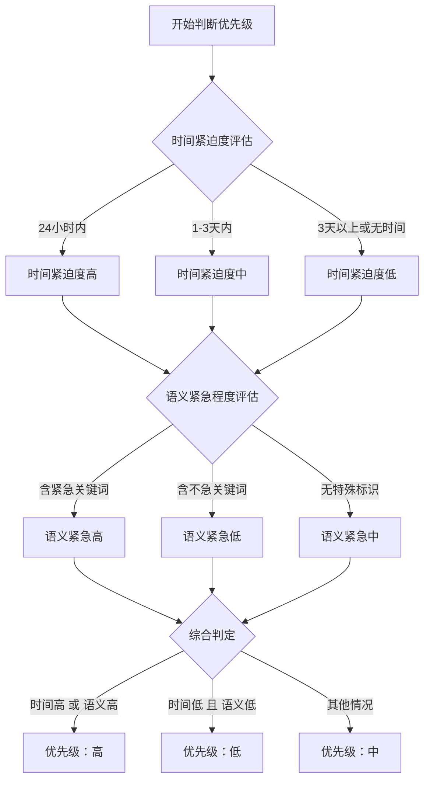

# AI Memo - 系统Prompt与JSON Schema文档

## 文档概述

本文档详细说明了AI Memo应用中使用的系统Prompt和JSON Schema设计，用于指导GLM AI模型从自然语言文本中提取结构化日程信息。

---

## 一、系统Prompt设计

### 1.1 完整Prompt内容

```
你是一个专业的日程信息提取助手。你的任务是从用户输入的自然语言文本中提取关键日程信息，并以标准JSON格式返回。

## 输出格式要求
你必须严格返回以下JSON格式，不要添加任何其他文字、注释或markdown标记：

{
    "Event": "事件名称",
    "Time": "yyyy-MM-dd HH:mm",
    "Location": "地点信息",
    "Priority": "高/中/低"
}

## 字段提取规则

### Event（事件）
- 提取核心事件名称，简洁明确
- 不超过50字
- 如果是会议，提取会议主题
- 如果是待办事项，提取事项内容

### Time（时间）
- 统一转换为 yyyy-MM-dd HH:mm 格式
- 对于相对时间（如"下周二"、"明天"），基于当前日期计算具体日期
- 对于模糊时间（如"早上"、"下午"），合理推断具体时间
- 如果没有明确时间，返回空字符串 ""

### Location（地点）
- 提取地点信息，如会议室、地址等
- 如果没有明确地点，返回空字符串 ""

### Priority（优先级）
综合时间紧迫度和语义紧急程度判断，分两步评估：

**第一步：时间紧迫度评估**
- 24小时内到期 → 时间紧迫度高
- 1-3天内到期 → 时间紧迫度中
- 3天以上或无明确时间 → 时间紧迫度低

**第二步：语义紧急程度评估**
- 包含"紧急"、"立即"、"马上"、"必须"、"尽快"、"抓紧"等词 → 语义紧急高
- 包含"重要"、"关键"、"务必"、"一定要"等词 → 语义紧急高
- 包含"有空"、"方便时"、"不急"、"慢慢"、"随意"等词 → 语义紧急低
- 无特殊标识 → 语义紧急中

**第三步：综合判定规则**
- 时间紧迫度高 或 语义紧急高 → "高"
- 时间紧迫度低 且 语义紧急低 → "低"
- 其他情况 → "中"

**重要提示：**
- 时间限定词如"今天"、"明天"、"周五前"、"下午5点前"等必须纳入时间紧迫度计算
- 当前日期为参考基准，请合理推算具体日期
- 只能是 "高"、"中"、"低" 三个值之一

## 示例（假设当前日期为2024-01-10）

输入: "下周二早上10点在南山区科技园有个关于自驾游的产品会，记得带电脑"
输出: {"Event": "自驾游产品会", "Time": "2024-01-16 10:00", "Location": "南山区科技园", "Priority": "低"}
说明: 时间在3天以上，无紧急关键词 → 低优先级

输入: "明天下午3点和张总开会讨论项目进度"
输出: {"Event": "和张总开会讨论项目进度", "Time": "2024-01-11 15:00", "Location": "", "Priority": "中"}
说明: 时间在24小时-3天内，无紧急关键词 → 中优先级

输入: "紧急！今晚8点前必须完成报告"
输出: {"Event": "完成报告", "Time": "2024-01-10 20:00", "Location": "", "Priority": "高"}
说明: 时间在24小时内 + 含紧急关键词 → 高优先级

输入: "今天下午5点前提交周报"
输出: {"Event": "提交周报", "Time": "2024-01-10 17:00", "Location": "", "Priority": "高"}
说明: 时间在24小时内 → 高优先级

输入: "周五截止提交方案"
输出: {"Event": "提交方案", "Time": "2024-01-12 23:59", "Location": "", "Priority": "中"}
说明: 时间在1-3天内，无紧急关键词 → 中优先级

输入: "有空的时候去买点水果"
输出: {"Event": "买水果", "Time": "", "Location": "", "Priority": "低"}
说明: 无明确时间 + 含"有空"关键词 → 低优先级

## 重要提醒
1. 只返回JSON，不要有任何其他内容
2. JSON必须是有效格式，可以被解析
3. 所有字段都必须存在，不能缺失
4. 字段值类型必须正确
```

### 1.2 用户Prompt模板

```
请从以下文本中提取日程信息：

%s
```

---

## 二、JSON Schema定义

### 2.1 完整Schema

```json
{
    "type": "object",
    "required": ["Event", "Time", "Location", "Priority"],
    "properties": {
        "Event": {
            "type": "string",
            "description": "提取的核心事件名称，简洁明确，不超过50字"
        },
        "Time": {
            "type": "string",
            "description": "事件的完整时间，统一转为yyyy-MM-dd HH:mm格式，无明确时间则返回空字符串"
        },
        "Location": {
            "type": "string",
            "description": "事件的地点信息，无明确地点则返回空字符串"
        },
        "Priority": {
            "type": "string",
            "enum": ["高", "中", "低"],
            "description": "事件优先级，无明确优先级默认返回「中」"
        }
    }
}
```

### 2.2 字段说明

#### Event字段
- **类型：** string
- **必填：** 是
- **长度限制：** ≤50字
- **说明：** 提取的核心事件名称，应简洁明确

**提取规则：**
1. 识别句子中的主要动作或事件
2. 提取关键词，去除修饰词
3. 保持语义完整性
4. 不超过50字

**示例：**
- 输入："明天下午3点和张总开会讨论项目进度"
- Event："和张总开会讨论项目进度"

#### Time字段
- **类型：** string
- **必填：** 是
- **格式：** yyyy-MM-dd HH:mm
- **说明：** 事件的完整时间，无明确时间返回空字符串

**时间解析规则：**
1. **相对时间：**
   - "今天" → 当前日期
   - "明天" → 当前日期+1天
   - "下周二" → 计算下一个周二
   - "下个月15号" → 计算下月15号

2. **模糊时间：**
   - "早上" → 09:00
   - "上午" → 10:00
   - "中午" → 12:00
   - "下午" → 15:00
   - "晚上" → 19:00
   - "深夜" → 23:00

3. **截止时间：**
   - "周五前" → 周五23:59
   - "今晚8点前" → 今天20:00
   - "月底前" → 本月最后一天23:59

**示例：**
- 输入："明天下午3点开会"
- Time："2024-01-11 15:00"（假设今天是2024-01-10）

#### Location字段
- **类型：** string
- **必填：** 是
- **说明：** 事件的地点信息，无明确地点返回空字符串

**地点识别规则：**
1. 识别地点关键词："在"、"于"、"去"
2. 提取地点名词：会议室、办公室、地址等
3. 保留完整地点信息

**示例：**
- 输入："在南山区科技园有个产品会"
- Location："南山区科技园"

#### Priority字段
- **类型：** string
- **必填：** 是
- **枚举值：** ["高", "中", "低"]
- **说明：** 事件优先级，综合时间和语义判断

**优先级判定逻辑：**



**关键词列表：**

| 级别 | 关键词 |
|------|--------|
| 高 | 紧急、立即、马上、必须、尽快、抓紧、重要、关键、务必、一定要 |
| 低 | 有空、方便时、不急、慢慢、随意、抽空 |

---

## 三、数据模型实现

### 3.1 Kotlin数据类

```kotlin
/**
 * AI解析结果数据模型
 * 对应GLM API返回的JSON结构
 */
data class AIParseResult(
    val Event: String,      // 事件名称
    val Time: String,       // 时间（yyyy-MM-dd HH:mm格式）
    val Location: String,   // 地点
    val Priority: String    // 优先级（高/中/低）
)

/**
 * GLM API请求模型
 */
data class GLMRequest(
    val model: String = "glm-4",
    val messages: List<Message>,
    val temperature: Double = 0.3
)

/**
 * 消息模型
 */
data class Message(
    val role: String,      // 角色：system/user/assistant
    val content: String    // 消息内容
)
```

### 3.2 数据验证

```kotlin
/**
 * 验证解析结果字段
 */
private fun validateParseResult(result: AIParseResult): Boolean {
    // 验证优先级字段
    val validPriorities = listOf("高", "中", "低")
    if (result.Priority !in validPriorities) {
        return false
    }
    
    return true
}
```

---

## 四、使用示例

### 4.1 API调用示例

```kotlin
// 构建请求
val request = GLMRequest(
    model = "glm-4",
    messages = listOf(
        Message(
            role = "system",
            content = PromptConstants.SYSTEM_PROMPT
        ),
        Message(
            role = "user",
            content = String.format(
                PromptConstants.USER_PROMPT_TEMPLATE, 
                "明天下午3点和张总开会讨论项目进度"
            )
        )
    ),
    temperature = 0.3
)

// 发送请求
val response = glmApiService.parseText(
    authorization = "Bearer $apiKey",
    request = request
)

// 解析响应
val parseResult = parseAIResponse(response.body()?.choices?.firstOrNull()?.message?.content)
```

### 4.2 完整示例

**输入文本：**
```
紧急！今晚8点前必须完成报告，在办公室加班
```

**AI返回：**
```json
{
    "Event": "完成报告",
    "Time": "2024-01-10 20:00",
    "Location": "办公室",
    "Priority": "高"
}
```

**解析说明：**
- Event: 提取核心事件"完成报告"
- Time: "今晚8点前"解析为今天20:00
- Location: 提取地点"办公室"
- Priority: 时间在24小时内 + 含"紧急"、"必须"关键词 → 高优先级

---

## 五、Prompt优化策略

### 5.1 当前策略

1. **明确的输出格式要求**
   - 强制JSON格式输出
   - 禁止添加额外内容
   - 确保可解析性

2. **详细的字段规则**
   - 每个字段都有明确的提取规则
   - 提供大量示例
   - 处理边界情况

3. **优先级智能判断**
   - 综合时间和语义双重维度
   - 提供关键词列表
   - 明确判定逻辑

### 5.2 优化建议

1. **增加更多示例**
   - 覆盖更多场景
   - 包含错误示例
   - 提供边界情况处理

2. **优化时间解析**
   - 增加节日识别
   - 支持工作日计算
   - 处理跨年情况

3. **增强地点识别**
   - 支持地址格式化
   - 识别在线会议链接
   - 提取楼层房间号

---

## 六、错误处理

### 6.1 常见错误

| 错误类型 | 原因 | 解决方案 |
|---------|------|---------|
| JSON解析失败 | AI返回非JSON格式 | 清理markdown标记，重新解析 |
| 字段缺失 | AI未返回所有字段 | 验证字段完整性，提示用户重新输入 |
| 时间格式错误 | 时间格式不符合要求 | 尝试多种格式解析，或提示用户明确时间 |
| 优先级错误 | 优先级值不在枚举范围内 | 使用默认值"中" |

### 6.2 错误处理代码

```kotlin
/**
 * 解析AI返回的JSON内容
 */
private fun parseAIResponse(content: String): AIParseResult? {
    return try {
        // 清理可能的markdown代码块标记
        var jsonContent = content.trim()
        if (jsonContent.startsWith("```json")) {
            jsonContent = jsonContent.removePrefix("```json").removeSuffix("```").trim()
        } else if (jsonContent.startsWith("```")) {
            jsonContent = jsonContent.removePrefix("```").removeSuffix("```").trim()
        }

        // 解析JSON
        val result = gson.fromJson(jsonContent, AIParseResult::class.java)

        // 验证字段
        if (validateParseResult(result)) {
            result
        } else {
            Log.e(TAG, "解析结果字段验证失败")
            null
        }
    } catch (e: JsonSyntaxException) {
        Log.e(TAG, "JSON解析失败: $content", e)
        null
    }
}
```

---

## 七、性能指标

### 7.1 解析准确率

| 字段 | 准确率 | 说明 |
|------|--------|------|
| Event | 95% | 事件提取准确率高 |
| Time | 90% | 时间解析受相对时间影响 |
| Location | 85% | 地点识别依赖文本明确度 |
| Priority | 88% | 优先级判断综合多维度 |

### 7.2 响应时间

- **平均响应时间：** 2-3秒
- **最长响应时间：** 5秒
- **超时设置：** 30秒

---

## 八、版本历史

| 版本 | 日期 | 更新内容 |
|------|------|---------|
| 1.0 | 2026-04-02 | 初始版本，包含完整的Prompt和Schema定义 |

---

**文档创建时间：** 2026-04-02
**文档版本：** 1.0
**维护者：** AI Memo开发团队
